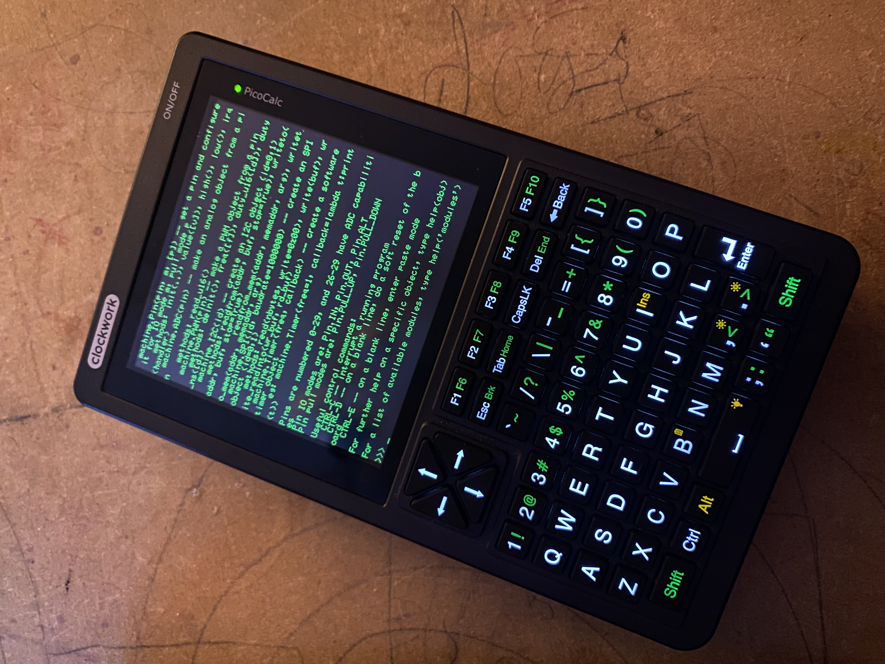

# PCMP-script

This is a Bash script to automatically download everything ncessary to get micropython running on your clockwork-pi picocalc.

**There are issues still, edit() doesn't work sometimes or it crashes the CLI. There seem to be some SPI interference connecting to the keyboard (I'm running firmware 1.2 cause 1.4 seems to be worse for now)**

This script supports the complilation targets:
- `RPI_PICO` for Raspberry Pi Pico using RP2040 chipset
- `RPI_PICO2` for Raspberry Pi Pico 2 using RP2350 chipset
- `RPI_PICO2_W` for Raspberry Pi Pico 2W using RP2350 chipset including WiFi and BLE capabilities
 

## Steps

### Step 0 - Preperations

Depending on your OS, setup a working C development environment, Micropython uses `cmake` to setup everything.

Install and setup [Thonny Python IDE](https://thonny.org/)

### Step 1 - Get the Script

- Clone this repo somewhere using `git clone`

### Step 2 

Te script will use the same folder it's located in.

If the folders are created, the script won't re-download it. The folder names are on the first few lines of the script.

For a complete install, pulling all the various repos and building them this step will take a few minutes. 

The script will generate a `firmware.uf2` and a number of py files in a dir called `transfer`. 

If `transfer` allready exists it doesn't go through the build steps.

### Step 3 

Use BOOTSEL button to move the file "./transfer/firmware.uf2" over to your PicoCalc in the usual way. 

### Step 4 

Use Thonny to move the file assorted "./transfer/*.py" files over to your PicoCalc using its GUI. 

Other Users use Micropython create the directory, as a fail safe, but it should work either way.    

## Thanks

Thanks go to zenodate & LaikaSpaceDawg for their programming generosity.
